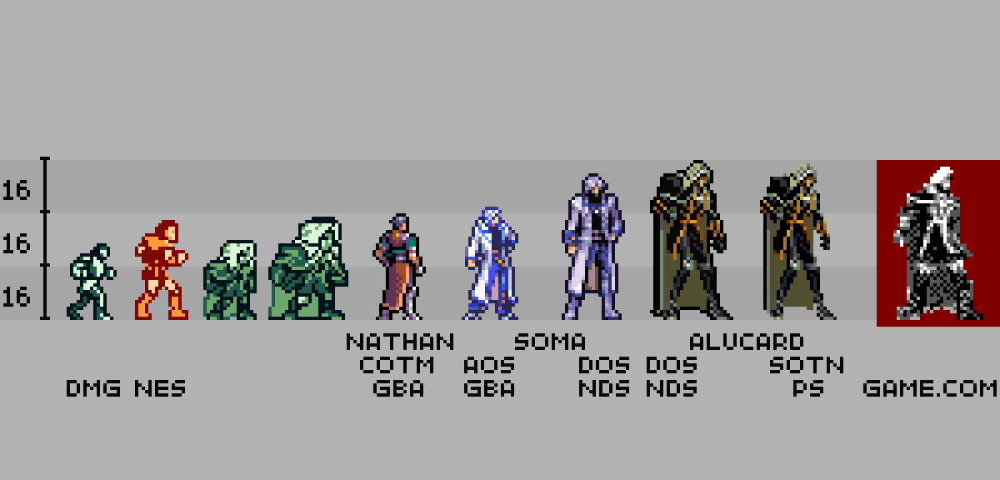
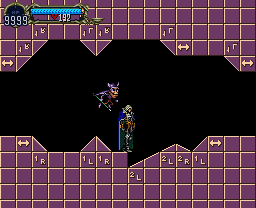
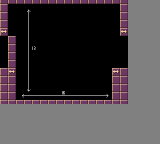
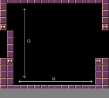

# Castlevania: Symphony Of The Night [Game.com – Cancelled] 

A portable version of Castlevania: Symphony Of The Night was in development for the [Game.com](https://en.wikipedia.org/wiki/Game.com), the ill-fated handled console created by Tiger Electronics in 1997, but soon the project vanished in the vaporware limbo and it’s unknown how much of the game was really completed before the cancellation. As other [Game.com](https://en.wikipedia.org/wiki/Game.com) titles (see Resident Evil 2), this Castlevania should have been a “downgraded port” of the Playstation / Saturn Symphony Of The Night, with some evident differences for the limits of the hardware.

## Sources:

- https://castlevania.fandom.com/wiki/Castlevania:_Symphony_of_the_Night_(Game.com)
- http://www.vgmuseum.com/mrp/2/canceled-page3.htm#gamecom
- https://www.unseen64.net/2008/04/07/castlevania-symphony-of-the-night-gamecom-cancelled/

# Castlevania: Symphony Of The Night [Gameboy Considerations]

Screens in SOTN (PSX) are 16x13 tiles, with each tile being 16 x 16 pixels. This makes each screen 256 x 208 pixel.

The Gameboy has a 160 x 144 screen resolusion with 8 x 8 pixels per sprite. The most easy way would be to reduce the resolution from the PSX version by 50% (scale down the 16x16 sprites to 8x8 sprites). But then you not only loose a lot of resolution, but also quite some screen estate:

It would be better to scale down by 62.5% (256/160), in order to maximize screen estate usage. But then you are dealing essentially 10x10 pixels per sprite, something the Gameboy doesn't support.

One solution could be to split the downscaled (160x130 picture) into 40x40 pixel blocks. These blocks would consists of 4x4 'original (10px)' tiles and convert to 5x5 (8px) Gameboy tiles.
So once screen would consist of 4x3 of these blocks, with an 'extra' 8 pixel line and dropping to 2 pixels (130 = 3 x 40 + 8 + 2)

